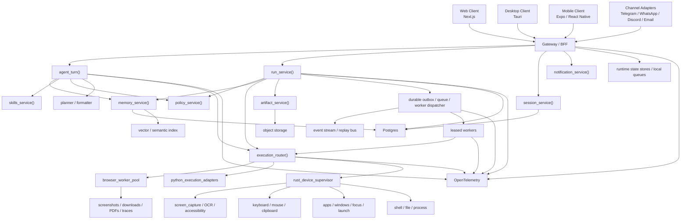

# Empyralis Canonical Architecture

## Source Of Truth

This document is the canonical architecture source of truth for Empyralis.

If a legacy document, exploratory plan, or older implementation path conflicts with this paper, this paper wins.

Core architectural changes to the platform must be deliberate owner decisions, not incidental drift.

## Thesis

Empyralis must become one coherent agent platform with many shells, one runtime contract, one turn engine, one run lifecycle, one memory facade, one tool contract, and one policy system.

The platform must be able to:

- reason over context
- operate software on behalf of the user
- see the user's screen on authorized machines
- control keyboards, mice, browser sessions, files, and apps on authorized machines
- run short-turn tasks and long durable workflows
- support web, desktop, mobile, and channel interfaces without separate reasoning stacks
- meet enterprise expectations for traceability, approvals, tenancy, and reliability
- support an owner-controlled full-trust mode where the platform operates without interactive approval prompts on explicitly authorized machines while still logging, tracing, and enforcing scoped capability policy

The platform must not be built around bypassing security controls, breaking into systems, crashing competitors, or evading operating-system safeguards. It must control only authorized computers and services under explicit user or tenant policy.

## Executive Decision

We must build Empyralis as:

- Next.js for the main web shell
- Tauri for the desktop shell
- Expo / React Native for the mobile shell
- Python as the short-term canonical orchestration runtime
- Rust as the high-trust local execution and device-control layer
- Postgres, object storage, and tracing as the durable operational substrate
- runtime state stores, local queues, and worker heartbeats as the active coordination substrate
- a durable queue, outbox, worker, and event-stream model for asynchronous work

## Final Language Decision

This is the final language policy for the platform.

### Approved Core Languages

- TypeScript for user-facing product shells
- Python for agent orchestration and runtime logic
- Rust for local trusted execution and device control
- SQL for durable state in Postgres

### Where Each Language Lives

#### TypeScript

TypeScript owns:

- the web product in [frontend](/Users/mansur/Multi_Agent_Orchestrator_Project/frontend)
- the desktop shell UI in [src-tauri](/Users/mansur/Multi_Agent_Orchestrator_Project/src-tauri) plus the shared React UI
- any shared client-side contracts and typed SDKs

TypeScript does not own:

- the canonical turn engine
- the canonical run service
- the machine-control layer
- durable workflow orchestration

#### Python

Python owns:

- `agent_turn()`
- `run_service()`
- `memory_service()`
- `skills_service()`
- `policy_service()`
- connector adapters
- provider routing
- artifact assembly
- compatibility workers
- scheduling and heartbeat entrypoints

Python remains the main product brain until the system is stable enough that moving pieces out of it would produce a clear operational benefit.

#### Rust

Rust owns:

- screen capture
- OCR-adjacent local execution plumbing where needed
- keyboard and mouse control
- clipboard and process access
- app and window control
- machine enrollment and attestation
- local capability enforcement
- high-trust local bridge logic

Rust does not own the whole product brain at the start.

Rust is introduced to make the local execution boundary stronger, not to trigger a repo-wide rewrite.

### Explicitly Rejected Language Moves

We should not:

- rewrite the orchestration core into Rust now
- introduce Flutter
- build a second backend in NestJS
- split runtime logic across Python and another orchestration language
- keep old Electron logic as a live development target

### Final Stack Freeze

If we want a final, concrete answer, it is this:

- Web UI: Next.js + React + TypeScript
- Desktop UI shell: Tauri + Rust + shared React UI
- Mobile: Expo / React Native + TypeScript
- Runtime core: Python
- Trusted local machine layer: Rust
- Durable database: Postgres
- Artifact store: S3-compatible object storage
- Ephemeral coordination: runtime state stores, local queues, and worker heartbeats
- Search and semantic recall: Postgres first, pgvector or equivalent when needed
- Eventing: durable outbox plus worker dispatcher and replay path

This is enough. We do not need more core languages.

## Final Product Design

The final product is one agent workspace with four surfaces:

- web
- desktop
- mobile
- channels

All four surfaces connect to the same runtime.

The final product is not:

- a web app plus unrelated mobile app
- a desktop-only operator
- a Telegram bot with a side UI
- multiple runtimes glued together

It is one platform with:

- one turn engine
- one run engine
- one memory path
- one machine-control path
- one audit path
- one artifact path

## What We Continue, What We Stop, What We Archive

### Continue Building In

- [frontend](/Users/mansur/Multi_Agent_Orchestrator_Project/frontend)
- [src-tauri](/Users/mansur/Multi_Agent_Orchestrator_Project/src-tauri)
- [mobile](/Users/mansur/Multi_Agent_Orchestrator_Project/mobile)
- [server.py](/Users/mansur/Multi_Agent_Orchestrator_Project/server.py)
- [server_modules](/Users/mansur/Multi_Agent_Orchestrator_Project/server_modules)
- [scripts](/Users/mansur/Multi_Agent_Orchestrator_Project/scripts)

### Stop Building New Core Logic In

- [backend](/Users/mansur/Multi_Agent_Orchestrator_Project/backend)
- [desktop](/Users/mansur/Multi_Agent_Orchestrator_Project/desktop)
- ad hoc duplicate docs not linked from current authoritative docs
- one-off runtime branches that bypass the canonical services

### Archive After Cutover

- legacy NestJS runtime paths
- archived legacy Electron launcher assets and notes
- stale mobile direct-AI bridge files
- checked-in runtime database artifacts

## Final System Shape

The system should settle into these major modules:

- `agent_turn.py`
- `run_service.py`
- `memory_service.py`
- `skills_service.py`
- `policy_service.py`
- `artifact_service.py`
- `machine_lease_service.py`
- `outbox_service.py`
- `worker_dispatch_service.py`
- `safe_mode_service.py`
- `circuit_breaker_service.py`
- Rust device supervisor

That is the final form we should build toward.

We must not do:

- a full cognition rewrite into Rust before runtime convergence
- a second mobile stack
- separate reasoning paths for web chat, channels, durable runs, or heartbeat
- channel-specific agent behavior
- uncontrolled computer-access features without approvals, scopes, and auditing
- vague "full access" semantics with no owner scope, no machine identity, and no kill switch

## Core Claim

The biggest problem in the repo is not missing features. It is architectural fragmentation.

Today the repo has:

- multiple agent loops
- overlapping run orchestration
- a large connector monolith
- parallel memory systems
- multiple desktop/runtime eras
- multiple documentation eras

Therefore the main strategy is:

1. converge the core
2. preserve the shells
3. isolate local machine execution
4. harden the system
5. scale the platform

## What The Platform Must Become

Empyralis should become a universal operator system for authorized digital work.

It should support:

- personal operator workflows
- team workflows
- enterprise approvals and audit
- remote machine supervision
- multi-agent delegation
- durable scheduled work
- artifact production
- connector-triggered work
- human-in-the-loop intervention
- computer screen interpretation and manipulation on approved devices

In plain terms: the system should be able to read a screen, understand what is visible, decide what to do, ask for approval when needed, operate the machine, and record exactly what happened.

## Non-Negotiable Architecture Rules

1. One message equals one engine.
   Every inbound human or system message must enter the same `agent_turn()` contract.

2. One run equals one lifecycle.
   Every queued or durable operation must flow through the same `run_service()`.

3. One memory access path.
   All retrieval of context, transcript, workspace knowledge, structured facts, and semantic recall must happen through `memory_service()`.

4. One skills and tools contract.
   Skills, tools, computer actions, and browser actions must resolve through one typed capability registry.

5. Thin adapters, thick core.
   Web, mobile, desktop, Telegram, WhatsApp, Discord, email, and future channels must not contain their own reasoning logic.

6. Computer control is explicit, scoped, and reviewable.
   Screen capture, clicking, typing, shell, clipboard, app control, browser sessions, and file operations are first-class capabilities, but every one of them must be policy-evaluated and auditable.

   In owner full-trust mode, approval prompts may be suppressed, but capability evaluation, audit, trace emission, scope checks, kill switches, and safe-mode downgrade must still remain active.

7. Rust is for local trust boundaries first.
   Rust must own device-local, security-sensitive, crash-sensitive capability execution before it owns the whole cognition stack.

8. Governance is part of the product.
   Audit logs, approvals, retention, RBAC, tenant isolation, and trace IDs are not optional.

9. Accessibility and DOM are primary when available.
   Browser DOM, browser accessibility data, operating-system accessibility APIs, and app-specific automation adapters must be preferred over screenshot OCR or coordinate heuristics.

10. Asynchronous work must have first-class durability.

11. Policy inheritance must be explicit.
   Policy resolution must never depend on hidden defaults or caller-local branching.

   The canonical precedence order is:

   - global
   - tenant
   - workspace
   - machine
   - capability

   This precedence applies to:

   - safe mode
   - kill switches
   - dangerous computer-action classes
   - machine enrollment scope
   - connector permissions

   Every durable run, approval, artifact, notification, and machine event must carry enough tenant and workspace provenance for audit isolation.
    The system must define a durable outbox, dispatch queue, worker lease, retry policy, poison-message handling, replay path, and event stream instead of treating background execution as implicit side effects.

## Platform Capability Model

Empyralis should expose a typed capability catalog.

### A. Screen And Visual Capabilities

These are legitimate and necessary.

- full display screenshot capture
- region screenshot capture
- multi-monitor screenshot capture
- OCR over full screen or regions
- image grounding against visible UI
- UI text search on current display
- visual change detection between frames
- screenshot artifact storage and replay
- screen-state summarization
- accessibility tree extraction where available
- application window enumeration
- focused window detection
- window title and PID resolution

### B. Human Input Capabilities

- mouse move
- mouse click
- double click
- right click
- drag and drop
- keyboard typing
- hotkeys and shortcuts
- paste from clipboard
- input into focused field
- text-based click targeting

### C. Application Capabilities

- list running applications
- launch application
- focus application
- focus window
- quit app with confirmation
- read app-local status through adapters
- app-specific automation through OS-native layers

### D. Browser Capabilities

- managed browser sessions
- tab creation and switching
- page navigation
- DOM interaction
- accessibility and semantic element targeting
- screenshot capture
- intercept network responses
- file downloads
- PDF snapshots
- persistent browser profiles
- session-backed interactive automation with approval

### E. System And File Capabilities

- shell commands
- read and write files
- directory listing
- artifact creation
- clipboard read and write
- notifications
- text-to-speech
- speech-to-text
- scheduled local actions

### F. Workflow And Coordination Capabilities

- short synchronous turns
- durable asynchronous runs
- approvals
- retry and resume
- schedules and heartbeat
- human takeover
- multi-agent delegation
- child runs
- replay
- run inspection

### G. Enterprise Capabilities

- tenant-scoped RBAC
- SSO, MFA, SCIM roadmap
- audit export
- artifact retention controls
- approval provenance
- credential access tracing
- policy simulation
- incident replay
- environment and connector health
- safe mode
- circuit breakers
- kill switches
- per-machine revocation

## Existing Computer-Control Surface In The Repo

The repo already proves this direction is possible.

Current local worker registration already includes:

- `capture_screenshot`
- `browser_automation`
- `computer_control.ocr`
- `computer_control.click`
- `computer_control.type`
- `computer_control.applescript`
- `computer_control.clipboard_read`
- `computer_control.clipboard_write`
- `computer_control.notify`
- `computer_control.list_apps`
- `computer_control.launch_app`
- `computer_control.speak`

Current code already includes:

- screenshot capture flows in [scripts/orion_local_worker_execution.py](/Users/mansur/Multi_Agent_Orchestrator_Project/scripts/orion_local_worker_execution.py)
- computer control functions in [server_modules/computer_control.py](/Users/mansur/Multi_Agent_Orchestrator_Project/server_modules/computer_control.py)
- browser session management in [server_modules/browser_engine.py](/Users/mansur/Multi_Agent_Orchestrator_Project/server_modules/browser_engine.py)
- tool policy gating in [server_modules/runtime_policy.py](/Users/mansur/Multi_Agent_Orchestrator_Project/server_modules/runtime_policy.py)

This means the right architecture is not theoretical. It is an extension and hardening of capabilities already present in the codebase.

## Full-Trust Owner Mode

The platform should support a deliberate owner-operated mode with default permission and full access on explicitly authorized machines.

This must not mean "no policy."

It must mean:

- the owner identity is explicitly configured
- the machine is explicitly enrolled
- the machine advertises its granted capabilities
- interactive approval prompts are bypassed only for that owner and those enrolled machines
- every action is still traced and audited
- the system can still downgrade to safe mode
- global and per-capability kill switches still work

The repo already has the beginnings of this model in `agent_machine_full_trust_enabled(...)` and related tests.

The correct product model is:

- owner full-trust mode for a user's own machines
- reviewed-approval mode for interactive or risky environments
- stricter enterprise policy modes for teams and tenants

## Canonical System Architecture



## System Layers

### 1. Client Plane

The client plane includes:

- web workbench
- desktop workbench
- mobile control surface
- channel-facing adapters

Responsibilities:

- show state
- stream activity
- collect user intent
- display approvals
- show artifacts
- replay runs
- let the user interrupt or continue

The client plane must never own separate reasoning logic.

### 2. Gateway Plane

The gateway is the policy-aware transport layer.

Responsibilities:

- authentication
- session bootstrap
- tenancy routing
- request normalization
- feature gating
- SSE or WebSocket streaming
- rate limiting
- request signing for local bridge interactions

The gateway should remain thin. It should route work to canonical runtime services.

### 3. Runtime Plane

This is the actual brain.

Core modules:

- `agent_turn()`
- `run_service()`
- `memory_service()`
- `skills_service()`
- `policy_service()`
- `execution_router()`
- `artifact_service()`
- `session_service()`

The runtime plane decides:

- what context to load
- what memory to retrieve
- which tools are permitted
- whether a reply is immediate or durable
- whether approval is required
- what artifacts to emit
- which execution target to use

### 4. Execution Plane

The execution plane performs actions decided by the runtime.

It must be split into:

- Python compatibility adapters for existing tools
- browser workers for controlled browser automation
- Rust device supervisor for local machine capabilities

This separation is critical because local device access is the highest-risk part of the platform.

### 5. Durable Eventing And Worker Plane

This plane must be explicit.

It owns:

- durable outbox writes
- task dispatch
- worker claim and lease
- worker heartbeat
- retry policy
- dead-letter handling
- replay
- event fan-out to UI and channels

Required elements:

- a run-state outbox table or equivalent durable outbox
- a queue transport with at-least-once semantics
- worker lease records with TTL
- poison-message and max-retry policy
- idempotency keys on all state-changing commands
- event replay for diagnostics and UI reconstruction

This plane can begin with Postgres-backed outbox plus the existing heartbeat model and later evolve into a stronger queue or bus design.

### 6. Data Plane

Target data responsibilities:

- Postgres for canonical state
- object storage for artifacts and heavy outputs
- runtime state stores, local queues, and worker heartbeats for ephemeral coordination
- vector storage for semantic memory
- SQLite only for local cache and offline scenarios

### 7. Governance Plane

This must be visible in every run:

- actor identity
- workspace and tenant identity
- capability set requested
- capability set actually granted
- approval requests and resolutions
- tool and connector actions
- artifact lineage
- credential access events
- trace IDs

It must also record:

- safe-mode downgrade events
- kill-switch activations
- machine enrollment and revocation events

### 8. Reliability And Recovery Plane

This must be explicit rather than implied.

The system must define:

- SLOs
- error budgets
- circuit breakers
- safe mode
- capability kill switches
- degraded operation modes
- worker recovery behavior
- replay and incident reconstruction
- queue backpressure policy

#### Safe Mode

Safe mode is a platform-wide or machine-local reduced-capability state.

When entered, the platform should:

- disable destructive or risky capabilities
- keep read-only visibility and run inspection alive
- pause or reject new interactive machine control
- preserve event streaming and incident evidence

#### Circuit Breakers

Circuit breakers must exist for:

- connector failures
- browser session instability
- machine-control failures
- queue backlog overload
- artifact storage failures
- provider instability

#### Kill Switches

Kill switches must exist at:

- global platform level
- tenant level
- workspace level
- machine level
- capability level
- connector level

Kill switches must be remotely activatable and locally enforceable.

## Computer Screen And Machine Control Architecture

This section is mandatory because full machine operation is part of the product.

### Principle

Empyralis must be able to see and operate an authorized computer, but it must do so through explicit capability boundaries and operating-system permissions, not through bypasses.

### What We Must Support

#### Screen Intake

- full screenshot capture
- region capture
- active-window capture
- multi-display capture
- OCR on current screen
- OCR on selected region
- accessibility tree extraction where available
- screenshot deduplication and compression
- screenshot artifact retention and replay

#### UI Interpretation

- detect visible UI text
- detect likely click targets
- map OCR regions to coordinates
- compare before and after states
- summarize active screen in natural language
- detect blockers such as dialogs, permission prompts, captchas, and hidden windows

#### Interaction

- coordinate-based click
- text-targeted click
- drag and drop
- keyboard typing
- shortcut execution
- clipboard-assisted input
- window focus and app launch

#### Safety

- capability scopes
- active-display requirement
- screen recording permission checks
- accessibility permission checks
- reviewed-approval requirement for interactive sessions
- replay logs and screenshots

### Computer Control Subsystems

#### A. Screen Capture Service

Responsibilities:

- capture screen images
- tag them by run, step, machine, and timestamp
- store raw and downscaled variants
- expose screen artifacts to runtime and UI

Inputs:

- machine target
- display or region
- capture mode

Outputs:

- screenshot artifact
- metadata
- optional OCR or accessibility attachment

#### B. Visual Interpretation Service

Responsibilities:

- OCR extraction
- UI text indexing
- element heuristics
- visible-state summarization
- grounding between text and coordinates

This can start in Python and gradually incorporate vision models or more advanced accessibility integration.

#### B1. Structured-First Targeting Hierarchy

The platform must prefer structured control paths in this order:

1. browser DOM selectors and browser accessibility data
2. operating-system accessibility APIs
3. application-specific automation adapters
4. OCR plus visual grounding
5. coordinate fallback

This matters because reliable control comes from using the most structured surface available and falling back only when necessary.

#### C. Input Control Service

Responsibilities:

- move and click mouse
- type keyboard input
- execute shortcuts
- paste from clipboard
- confirm focused window

This should ultimately live under the Rust device supervisor, with Python orchestration issuing signed requests.

#### D. Window And App Service

Responsibilities:

- list running apps
- list windows
- focus app or window
- launch app
- verify app foreground state
- capture active window metadata

#### E. Browser Session Service

Responsibilities:

- manage long-lived browser contexts
- keep session profiles
- capture screenshots and downloads
- record network intercepts
- support approval-gated interactive automation

#### F. Machine Lease Service

Responsibilities:

- assign a run to a specific machine
- verify the machine is online
- confirm permissions available
- serialize exclusive interactive tasks when needed
- prevent two runs from fighting over the same mouse and keyboard

This is required if the platform is to control computers reliably.

### Machine Identity And Lease Contract

The platform needs a formal machine-control contract, not just a loose "local machine" idea.

Each enrolled machine must have:

- machine ID
- owner or tenant binding
- signed enrollment record
- OS and version metadata
- capability inventory
- permission probe results
- last-heartbeat time
- current lease holder
- safe-mode status
- revocation status

Each machine lease must include:

- lease ID
- run ID
- workspace ID
- actor identity
- capability set requested
- capability set granted
- lease start time
- TTL
- heartbeat cadence
- revocation token
- contention strategy

Each machine must support:

- permission probing for screen recording, accessibility, browser, filesystem, shell, and app control
- capability attestation before interactive work
- exclusive interactive lease mode for keyboard and mouse work
- revocation and forced release
- session cleanup after interruption

### Heartbeat As A Canonical Turn Source

Heartbeat must not be a separate pseudo-agent system.

Heartbeat should be modeled as:

- a scheduled source of `AgentTurnRequest`
- same context loader
- same memory path
- same policy engine
- same execution router
- same audit and trace path

The only difference is actor type and trigger source.

That means heartbeat jobs should generate turn requests such as:

```python
AgentTurnRequest(
    tenant_id=...,
    workspace_id=...,
    session_id="heartbeat:<workspace>",
    channel="heartbeat",
    actor={"type": "system_scheduler"},
    message="Execute pending heartbeat directives.",
    attachments=[],
    context_hints={"heartbeat": True},
    execution_mode="durable",
    response_mode="artifact",
    machine_target=None,
    policy_context={"source": "heartbeat"},
)
```

## Canonical Contracts

### Agent Turn Contract

```python
AgentTurnRequest(
    tenant_id,
    workspace_id,
    session_id,
    channel,
    actor,
    message,
    attachments,
    context_hints,
    execution_mode,  # sync or durable
    response_mode,   # stream, artifact, channel_reply
    machine_target,  # local, remote, specific lease, browser session, none
    policy_context,
)
```

Responsibilities:

- load session and workspace context
- retrieve memory
- resolve skills, tools, and policies
- choose immediate reply vs durable run
- choose machine and execution target
- emit normalized response objects, artifacts, and approval requests

### Run Contract

Canonical run states:

- queued
- planning
- waiting_approval
- machine_allocating
- executing
- blocked
- retrying
- completed
- failed
- canceled

Every transition must be:

- durable
- idempotent
- timestamped
- trace-linked
- replayable

### Outbox And Eventing Contract

Every run-affecting state change must emit an outbox event.

Minimum event types:

- turn_received
- turn_classified
- run_created
- run_state_changed
- approval_requested
- approval_resolved
- machine_lease_requested
- machine_lease_granted
- machine_lease_revoked
- capability_denied
- capability_executed
- artifact_created
- run_completed
- run_failed
- safe_mode_entered
- kill_switch_activated

Each event must carry:

- event ID
- tenant and workspace IDs
- run ID
- step ID when applicable
- trace ID
- actor
- machine ID when applicable
- timestamps
- idempotency key

### Capability Contract

Every tool or machine action must declare:

- capability ID
- risk level
- required approvals
- allowed tenants
- allowed environments
- required OS permissions
- reversible or irreversible status
- artifact outputs

Examples:

- `screenshot.capture`
- `computer_control.ocr`
- `computer_control.click`
- `computer_control.type`
- `computer_control.clipboard_read`
- `computer_control.clipboard_write`
- `computer_control.launch_app`
- `browser_automation.interactive`
- `shell.execute`
- `filesystem.write`

## Repo Mapping

### Preserve

- [frontend](/Users/mansur/Multi_Agent_Orchestrator_Project/frontend)
- [src-tauri](/Users/mansur/Multi_Agent_Orchestrator_Project/src-tauri)
- [mobile](/Users/mansur/Multi_Agent_Orchestrator_Project/mobile)
- [server.py](/Users/mansur/Multi_Agent_Orchestrator_Project/server.py)
- [server_modules](/Users/mansur/Multi_Agent_Orchestrator_Project/server_modules)
- [scripts/orion_local_worker.py](/Users/mansur/Multi_Agent_Orchestrator_Project/scripts/orion_local_worker.py)
- [server_modules/browser_engine.py](/Users/mansur/Multi_Agent_Orchestrator_Project/server_modules/browser_engine.py)
- [server_modules/computer_control.py](/Users/mansur/Multi_Agent_Orchestrator_Project/server_modules/computer_control.py)

### Refactor Aggressively

- [server_modules/operator_chat.py](/Users/mansur/Multi_Agent_Orchestrator_Project/server_modules/operator_chat.py)
- [server_modules/runtime_runs_api.py](/Users/mansur/Multi_Agent_Orchestrator_Project/server_modules/runtime_runs_api.py)
- [server_modules/runs_core.py](/Users/mansur/Multi_Agent_Orchestrator_Project/server_modules/runs_core.py)
- [server_modules/runs_delegation.py](/Users/mansur/Multi_Agent_Orchestrator_Project/server_modules/runs_delegation.py)
- [server_modules/autopilot_connectors.py](/Users/mansur/Multi_Agent_Orchestrator_Project/server_modules/autopilot_connectors.py)
- [server_modules/runtime_memory.py](/Users/mansur/Multi_Agent_Orchestrator_Project/server_modules/runtime_memory.py)
- current skill loading and prompt-append paths

### Introduce

- `server_modules/agent_turn.py`
- `server_modules/run_service.py`
- `server_modules/memory_service.py`
- `server_modules/skills_service.py`
- `server_modules/policy_service.py`
- `server_modules/artifact_service.py`
- `server_modules/machine_lease_service.py`
- `server_modules/outbox_service.py`
- `server_modules/worker_dispatch_service.py`
- `server_modules/safe_mode_service.py`
- `server_modules/circuit_breaker_service.py`
- `server_modules/connectors/base.py`
- `server_modules/connectors/telegram.py`
- `server_modules/connectors/whatsapp.py`
- `server_modules/connectors/discord.py`
- Rust device supervisor under desktop or runtime boundary

### Archived Or Frozen Legacy Paths

- [backend](/Users/mansur/Multi_Agent_Orchestrator_Project/backend)
- historical Electron launcher path removed from the active repo tree

[backend](/Users/mansur/Multi_Agent_Orchestrator_Project/backend) remains frozen for reference. The legacy Electron shell has already been archived out of the active repo and is no longer a supported runtime path.

## What The Platform Should Include To Be Truly Powerful

This section answers the product question directly.

### Must-Have

- canonical turn engine
- canonical run service
- memory facade
- tool and skill contract
- connector adapter system
- browser automation
- computer screen capture and OCR
- click and type control
- app launch and focus
- approvals
- audit trail
- artifacts
- replay
- mobile supervision
- desktop local bridge
- notifications
- schedules and heartbeat

### High-Value Next

- accessibility tree integration
- multi-monitor awareness
- machine leasing and contention management
- machine permission probing and capability attestation
- default owner full-trust profiles with revocation
- remote machine pools
- shared session handoff between agents
- outcome-pack templates
- richer artifact cards
- semantic memory evaluation and freshness tracking
- workspace directives
- environment readiness and doctor flows
- connector-specific operational dashboards

### Enterprise-Grade Additions

- tenant isolation
- SSO
- MFA
- SCIM roadmap
- approval policies by workspace, action, and environment
- retention policies
- audit export
- security event streaming
- incident replay
- signed releases
- SBOMs
- provenance attestations
- global and tenant kill switches
- circuit-breaker policy dashboards
- machine fleet health and permission dashboards

### Powerful But Legitimate End-State

Empyralis should be able to:

- operate a user's own desktop end to end
- monitor browser workflows
- read, summarize, and act on what is visible on screen
- perform research workflows with artifacts and citations
- supervise long-running digital operations
- coordinate specialized agents against shared state
- let a user intervene at any time

That is enough to make the platform dramatically more powerful than parallel products without crossing into offensive or abusive design.

## Explicit Non-Goals

Empyralis must not include:

- security bypass mechanisms
- anti-detection or evasion features
- malware-style persistence
- destructive sabotage features
- capabilities aimed at crashing competitors or external platforms
- covert control of unauthorized machines
- hidden execution without traceability

If a capability requires violating the operating system, user trust, or tenant boundaries, it is out of scope.

## Phased Execution Plan

### Phase 0: Freeze Architecture

Time: 3-5 days

We must:

- declare the Python runtime canonical for the refactor
- declare Next.js + Tauri + Expo as the client stack
- freeze new work that deepens runtime fragmentation
- write ADRs for turn engine, run service, memory, channels, skills, machine control, and shared client APIs

### Phase 1: Build `agent_turn()`

Time: ~2 weeks

We must:

- extract the canonical turn path from `operator_chat.py`
- route web chat through it first
- define typed turn request and response envelopes
- make `runtime_runs_api.py` transport-oriented

### Phase 2: Build `run_service()`

Time: ~1-2 weeks

We must:

- merge `runs_core.py` and `runs_delegation.py`
- define the run state machine
- make every transition durable and idempotent
- normalize approvals into one lifecycle

### Phase 3: Split Connector Monolith

Time: ~2 weeks

We must:

- break `autopilot_connectors.py` into thin adapters
- normalize inbound event schemas
- remove silent drop paths
- separate reply formatting from reasoning

### Phase 4: Build `memory_service()` And `skills_service()`

Time: ~1-2 weeks

We must:

- unify transcript, workspace, structured, and semantic memory
- unify skill resolution and tool contracts
- eliminate split prompt-append and handler pathways

### Phase 5: Formalize Computer Control

Time: ~2 weeks

We must:

- define screen, OCR, click, type, app, clipboard, browser, and shell capabilities
- add machine lease and exclusive interactive-session rules
- add machine identity, permission probing, capability attestation, TTLs, revocation, and contention control
- expose screenshot and computer-control artifacts in the UI
- define reviewed-approval rules for interactive control
- define owner full-trust rules for default-permission operation on enrolled machines

### Phase 6: Introduce Rust Device Supervisor

Time: parallel track

We must:

- move high-trust machine operations behind Rust
- keep Python orchestration above it
- add signed local requests and scoped capability tokens
- support screen capture, keyboard, mouse, files, processes, windows, and app control
- prefer accessibility and structured control APIs before OCR fallback

### Phase 7: Shared Client Contract

Time: ~1 week

We must expose stable APIs for:

- `/turn`
- `/runs`
- `/runs/{id}`
- `/approvals`
- `/artifacts`
- `/sessions`
- `/health`
- `/connectors`
- `/notifications`
- `/machines`

### Phase 8: Durable State And Observability

Time: ~2-3 weeks

We must:

- move canonical durable state to Postgres
- move artifacts to object storage
- harden runtime state stores, local queues, and worker lease coordination
- add OpenTelemetry traces, logs, and metrics
- add per-run trace IDs and audit lineage
- add outbox and event replay
- define worker lease TTL and recovery behavior

### Phase 9: Enterprise Hardening

Time: ongoing

We must:

- add SSO, MFA, RBAC, SCIM roadmap
- add retention and audit export
- add release signing, SBOMs, provenance
- add CI on PRs and main
- add dependency and secrets scanning
- add incident runbooks and customer-facing reliability docs

## Current Accepted Temporary Boundaries

This section records the remaining non-canonical edges that are accepted temporarily as of the current repo audit.

They are not alternate architectures. They are bounded exceptions that must remain explicit until removed.

1. Browser/session automation is still Python-owned.

   Accepted boundary:

   - [browser_engine.py](/Users/mansur/Multi_Agent_Orchestrator_Project/server_modules/browser_engine.py) remains the temporary Playwright-based adapter
   - [execution_router.py](/Users/mansur/Multi_Agent_Orchestrator_Project/server_modules/execution_router.py) is the only authorized path into that adapter
   - Rust remains the owner of direct device control

2. Memory is canonically accessed through one facade but still split internally.

   Accepted boundary:

   - [memory_service.py](/Users/mansur/Multi_Agent_Orchestrator_Project/server_modules/memory_service.py) is the only public access path
   - [agent_memory.py](/Users/mansur/Multi_Agent_Orchestrator_Project/server_modules/agent_memory.py) and [runtime_memory.py](/Users/mansur/Multi_Agent_Orchestrator_Project/server_modules/runtime_memory.py) remain private implementation modules behind that facade

3. Object storage is canonical at the interface level, but development storage is still filesystem-backed.

   Accepted boundary:

   - [artifact_service.py](/Users/mansur/Multi_Agent_Orchestrator_Project/server_modules/artifact_service.py) exposes canonical artifact records and object-store-shaped URIs
   - the current development backend stores objects under `.orion-object-store/`
   - external S3-compatible backing remains a deployment follow-through item

4. Enterprise hardening is still incomplete.

   Accepted boundary:

   - tenant/workspace policy inheritance, kill switches, safe mode, notifications, and machine fleet controls are implemented
   - SSO, MFA, SCIM, SBOM/provenance attestations, PR/main CI, dependency and secrets scanning, and customer-facing runbooks remain deferred enterprise work

## Reliability Targets

Initial targets should be:

- control plane API: 99.9%
- run enqueue acknowledgment: p95 under 500 ms
- approval propagation: p95 under 2 s
- artifact availability after completion: p95 under 5 s
- channel reply delivery success: 99.5%+
- no silent event drops
- full replayable trace for every failed run
- safe-mode downgrade under operator command in under 10 seconds
- machine lease revocation propagation under 5 seconds

## Final Verdict

The best architecture is:

- Python-first orchestration
- Rust-first machine execution
- Next.js + Tauri + Expo as permanent shells
- one canonical `agent_turn()`
- one canonical `run_service()`
- one `memory_service()`
- one typed capability and skills registry
- first-class computer screen and machine control on authorized systems
- explicit durable outbox, queue, worker, and replay plane
- accessibility-first control, OCR-second control
- formal owner full-trust mode with machine identity and kill-switch backstops
- thin channels
- durable auditability and enterprise reliability

This is the architecture Empyralis should follow.

This is the architecture we must implement.

This is the architecture that gives the platform the highest power, coherence, and defensibility without drifting into unsafe or offensive design.
