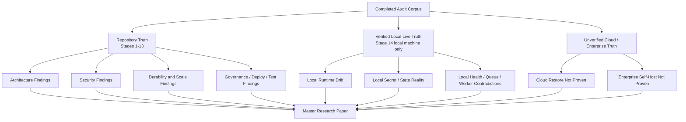
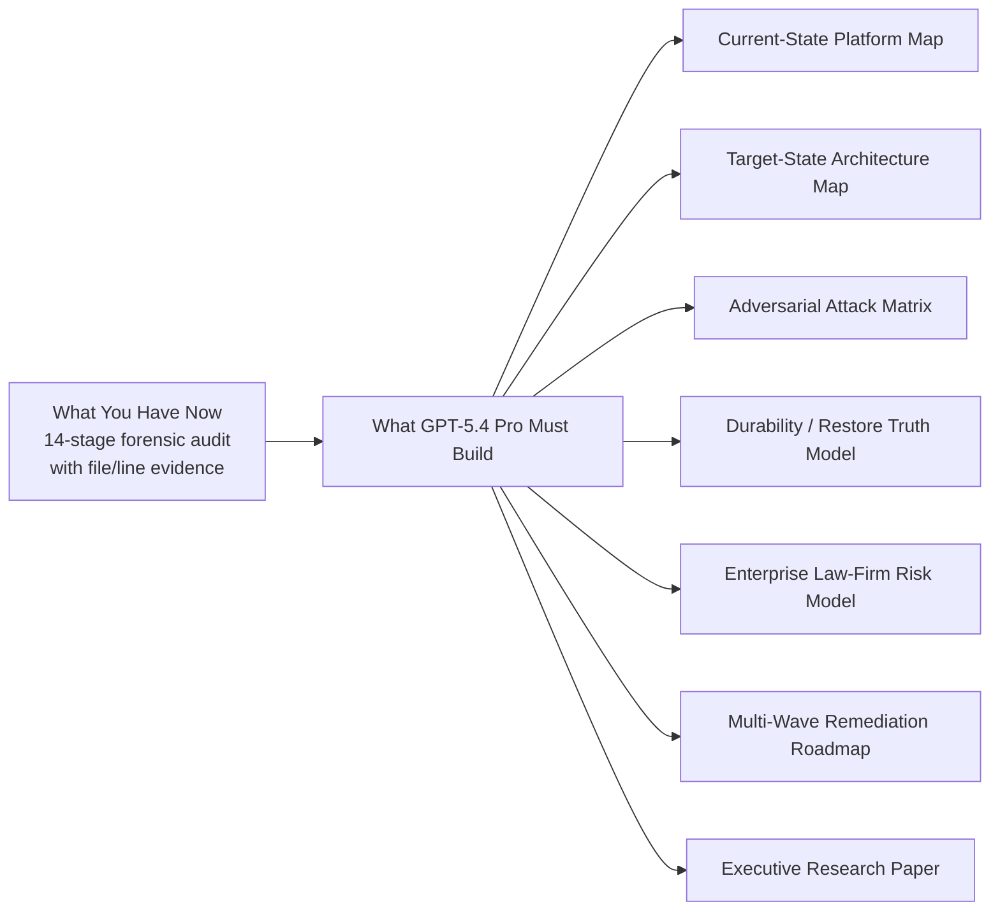
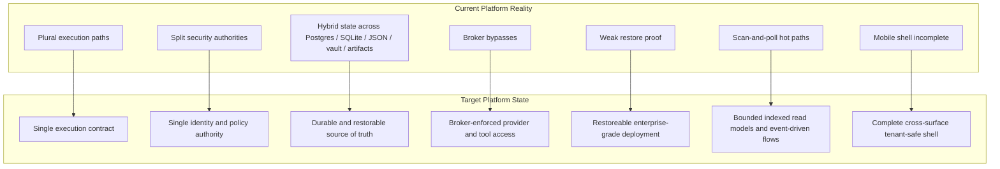

# GPT-5.4 Pro Forensic Research Playbook

## Purpose

This file is the control document for turning the completed forensic audit into a high-value GPT-5.4 Pro research program.

The goal is not to generate a vague paper.

The goal is to turn the audit into:

1. a master research paper
2. a platform-wide current-state map
3. a target-state control architecture
4. an adversarial exploit and failure model
5. a prioritized remediation roadmap

This playbook is designed to preserve rigor from the audit and prevent GPT-5.4 Pro from collapsing:

- repo truth into deployment truth
- suspicions into facts
- broad architecture critique into soft product writing

## What You Have Right Now

You do **not** have a perfect omniscient map of every live environment.

You **do** have a strong, high-value platform map across these truth domains:

1. repository truth
2. verified local-live truth
3. partially verified deployment truth
4. unverified cloud and enterprise truth

That is enough to produce a serious master-level research paper, as long as GPT-5.4 Pro is forced to preserve those truth boundaries.

## Truth Boundary Rules

These rules must be repeated to GPT-5.4 Pro in the first message.

1. `Repository truth` means the code, docs, workflows, scripts, migrations, tests, and local reference implementations visible in this repository.
2. `Verified local-live truth` means facts proven from the actual local running environment during Stage 14.
3. `Unverified cloud truth` means cloud claims that were described in code/docs but not directly verified in a real cloud deployment.
4. `Unverified enterprise truth` means enterprise/law-firm/self-host behavior not directly validated in a real deployment.
5. `Proven issues` must stay proven.
6. `Strong suspicions` must stay suspicions.
7. `Low-confidence concerns` must stay low-confidence.

If GPT-5.4 Pro violates those rules, the output becomes less useful than the audit itself.

## Visual: Evidence Reality Map



## Visual: What You Have vs What You Want



## Visual: Current State vs Target State



## Best Strategy for GPT-5.4 Pro

Do **not** paste all audit stages and ask for a paper immediately.

Use a three-phase workflow:

1. `Ingestion`
2. `Synthesis`
3. `Final paper and control maps`

### Why this is the best method

Because GPT-5.4 Pro performs best when:

- the evidence is labeled
- the confidence boundaries are explicit
- the deliverables are staged
- the final paper is not generated until the evidence model is stable

If you skip that structure, GPT-5.4 Pro will usually:

- smooth over contradictions
- flatten confidence levels
- overstate what was proven
- understate what remains unverified

## Required Input Set

Feed GPT-5.4 Pro the full audit outputs as labeled evidence packets.

Do **not** omit Stage 12 or Stage 14.

### Minimum mandatory packets

If context becomes tight, these are non-negotiable:

1. Stage 12
2. Stage 14
3. Stage 4
4. Stage 5
5. Stage 6
6. Stage 9
7. Stage 10
8. Stage 11

### Preferred full packet order

Use this exact order:

1. `Stage 12 - Final Forensic Scorecard`
2. `Stage 14 - Live Environment, Drift, and Restore Audit`
3. `Stage 4 - Amnesia Wall and Security Boundary`
4. `Stage 5 - Broker, Capability, and Runtime Isolation`
5. `Stage 6 - Durability, Concurrency, and Replay Safety`
6. `Stage 9 - Data Governance, Schema, and Retention Truth`
7. `Stage 10 - Build, Deployment, Config, Secrets, and Supply-Chain Audit`
8. `Stage 11 - Test Coverage, Observability, and Disaster-Recovery Readiness`
9. `Stage 3 - Bloat and Spaghetti Hunt`
10. `Stage 7 - Scale and Bottlenecks`
11. `Stage 8 - Frontend and Mobile Multi-Tenant Shell Audit`
12. `Stage 1`
13. `Stage 2`
14. `Stage 13 - Competitive Reference Benchmark`

This order is intentional:

- `Stage 12` gives the spine
- `Stage 14` corrects repo fantasy with real local-live truth
- `Stages 4-6` define the hard security/durability body
- `Stages 9-11` define governance and operational credibility
- the rest sharpen scale, architecture, shell integrity, and benchmark posture

## How to Package the Audit

Each stage should be sent as a separate packet.

Before each stage output, prepend this wrapper:

```text
EVIDENCE PACKET: STAGE X
Title: <stage title>
Truth domain: <repo-only | verified local-live | mixed>
Priority: <critical | high | medium>
Use this packet as evidence. Do not summarize yet. Wait for more packets.
```

### Truth domain labels to use

- `repo-only`
  - stages based purely on repository and local file evidence
- `verified local-live`
  - Stage 14 local machine facts
- `mixed`
  - stages that combine repo evidence with live verification or cross-stage reasoning

## Exact GPT-5.4 Pro Intake Prompt

Paste this in a fresh GPT-5.4 Pro thread before any evidence packets:

```text
You are acting as a hostile principal engineer, security researcher, SRE, enterprise platform auditor, and systems architect.

Your task is to convert a completed forensic audit into a master research program and final research paper for a large platform.

Non-negotiable rules:

1. Treat every audit stage as evidence, not as unquestionable truth.
2. Preserve these confidence classes exactly:
   - proven issues
   - strong suspicions
   - low-confidence concerns
3. Never upgrade a suspicion into a fact.
4. Never invent repository facts, deployment facts, mitigations, or exploit chains not grounded in the evidence packets.
5. Distinguish these truth domains at all times:
   - repository truth
   - verified local-live truth
   - unverified cloud truth
   - unverified enterprise truth
6. Every major claim must cite the stage number and the file/line evidence exactly as provided in the packets.
7. If evidence is insufficient, say insufficient.
8. Be adversarial, technical, and unsentimental. Do not produce marketing language.
9. Focus especially on:
   - split authorities
   - fake abstractions
   - second identity models
   - policy bypasses
   - hidden durability gaps
   - restore illusions
   - deployment drift
   - law-firm/private deployment risk
10. Do not write the final paper until I explicitly tell you to do so.

Working protocol:

- I will send labeled evidence packets in multiple messages.
- Until I say SYNTHESIZE, reply only with:
  READY FOR NEXT PACKET
- When I say SYNTHESIZE, first produce:
  1. evidence map
  2. contradiction map
  3. missing-proof map
  4. adversarial attack-surface map
  5. proposed structure for the final master paper
- Do not write the full paper in the synthesis phase.

Important constraint:

This audit is close to a full repository map and a partial live-environment map.
It is not a full cloud or enterprise live proof.
You must not present cloud or enterprise deployment claims as verified unless a packet explicitly proves them.
```

## Exact Synthesis Prompt

After all packets are sent, paste this:

```text
SYNTHESIZE

Using all evidence packets received so far, produce:

1. Evidence map
   - grouped by domain
   - with confidence labels
   - with major contradictions called out

2. Contradiction map
   - where repository truth and live truth disagree
   - where architecture claims and actual behavior disagree
   - where policy model and execution reality disagree

3. Missing-proof map
   - what still cannot be proven
   - which missing proofs are most dangerous
   - which missing proofs block enterprise claims

4. Adversarial attack-surface map
   - likely exploit chains
   - privilege-bleed paths
   - replay/restore abuse paths
   - law-firm/private deployment risks

5. Final paper outline
   - section order
   - thesis per section
   - what evidence belongs in each section

Rules:
- findings first
- no fluff
- preserve proven vs suspected vs low-confidence
- cite stage numbers aggressively
- do not write the final paper yet
```

## Exact Final Research Paper Prompt

Once the synthesis is correct, paste this:

```text
Now write the final master research paper.

Requirements:

1. Write it as an executive-grade but technically adversarial research paper.
2. Base it only on the evidence packets and synthesis already established.
3. Preserve all confidence distinctions:
   - proven issues
   - strong suspicions
   - low-confidence concerns
4. Separate clearly:
   - repository truth
   - verified local-live truth
   - unverified cloud truth
   - unverified enterprise truth
5. Do not soften the verdicts.
6. Every major section must include stage references and underlying file/line evidence.
7. Include these sections:

- Executive thesis
- Platform truth model
- Current-state system map
- Security and tenant isolation
- Broker, capability, and runtime control
- Durability, replay, and concurrency truth
- Data governance, retention, and restoreability
- Build, deployment, config, and secret drift
- Scale posture and first-failure map
- Frontend/mobile tenancy integrity
- Architectural fat and fake separation
- Adversarial attack scenarios
- Enterprise law-firm deployment implications
- Current-state vs target-state architecture
- Remediation waves
- Blockers to enterprise-grade status
- What remains unproven

8. Include visual sections using Mermaid for:
- current-state platform map
- target-state platform map
- control-boundary map
- remediation roadmap

9. End with:
- brutal verdict
- enterprise readiness verdict
- exact reasons that verdict is blocked
```

## Exact Adversarial Simulation Prompt

Use this after the final paper:

```text
Using only the established evidence, build a hostile simulation matrix.

For each scenario, provide:
- prerequisites
- exact exploit chain
- required assumptions
- expected blast radius
- what telemetry would or would not detect it
- whether recovery is possible
- what invariant must hold to block it

Scenarios:
- foreign session adoption across workspace boundaries
- direct-chat broker bypass abuse
- local-companion identity drift
- duplicate delivery and replay abuse
- stale restore with partial store recovery
- autopilot connector abuse after state drift
- entitlement/profile mismatch after workspace changes
- law-firm/private tenant confidentiality breach

Do not invent defenses that were not proven in the evidence.
```

## Exact Remediation Program Prompt

Use this after the final paper if you want GPT-5.4 Pro to convert the research into a disciplined platform-improvement program:

```text
Using only the established evidence and final paper, build a master remediation program for the platform.

Requirements:

1. Do not propose cosmetic work.
2. Organize the work by dependency and architectural leverage.
3. Separate:
   - stop-the-bleeding fixes
   - authority unification
   - durability / restoreability
   - scale / read-model repair
   - shell completion
   - architectural simplification
4. For each workstream provide:
   - objective
   - exact problems solved
   - prerequisite work
   - files / subsystems affected
   - risk of change
   - expected platform gain
   - what must be true before the workstream can be called done
5. Produce:
   - Wave 0
   - Wave 1
   - Wave 2
   - Wave 3
   - Wave 4
6. Include a current-state to target-state migration narrative.
7. Include a Mermaid roadmap diagram.
8. Include a “do not build features before these are fixed” section.

Rules:
- no fluff
- no fake deadlines
- no invented infrastructure
- no implementation details that were not grounded in evidence
- optimize for platform control, security, restoreability, and clarity
```

## Exact Visual-Map Prompt

If you want GPT-5.4 Pro to focus specifically on platform mapping, use this after synthesis and before the final paper:

```text
Build a full visual control map of the platform using only the evidence already established.

Required outputs:

1. Current-state platform map in Mermaid
   - ingress paths
   - auth boundaries
   - broker/tool boundaries
   - runtime targets
   - data stores
   - channel systems
   - frontend/mobile shells

2. Current-state trust-boundary map in Mermaid
   - trusted authorities
   - second authorities
   - bypass paths
   - cross-store drift points

3. Target-state platform map in Mermaid
   - single execution contract
   - single identity authority
   - single policy authority
   - durable restoreable state model
   - bounded read model
   - enterprise-safe shell model

4. Current-state vs target-state gap matrix
   - what exists now
   - what must be removed
   - what must be merged
   - what must be built

5. Remediation-wave map
   - Wave 0: stop-the-bleeding fixes
   - Wave 1: security and authority unification
   - Wave 2: durability and restoreability
   - Wave 3: scale and shell completion
   - Wave 4: simplification and enterprise hardening

Rules:
- findings first
- no generic architecture diagrams
- no invented components
- every node must map back to established evidence
```

## Exact Current-State vs Future-State Prompt

If you want a concrete picture of what you have now versus what you are trying to build, use this:

```text
Using only the established evidence, describe the platform in two states:

1. What I have right now
2. What I should have after the remediation program

For each state, provide:
- architecture summary
- security posture
- data truth model
- runtime control model
- tenant isolation model
- delivery/replay model
- scale posture
- operator control level
- enterprise law-firm suitability

Then provide:
- a Mermaid diagram for the current state
- a Mermaid diagram for the target state
- a step-by-step transition path from current to target
- why the target state is technically superior

Do not use marketing language.
Do not invent features.
Base every statement on established evidence.
```

## Output Contract for GPT-5.4 Pro

You should require the model to produce these deliverables:

1. `Evidence map`
2. `Contradiction map`
3. `Missing-proof map`
4. `Current-state platform map`
5. `Target-state platform map`
6. `Attack-surface matrix`
7. `Failure-mode matrix`
8. `Enterprise law-firm deployment risk section`
9. `Remediation roadmap`
10. `Final research paper`

## What the Final Research Paper Must Explicitly Show

The final paper should explicitly show:

### Current-state platform reality

- what the platform really is today
- which components are trustworthy
- which subsystems are split or fake
- where state lives
- how execution actually flows
- how trust actually flows

### Target-state architecture

- what the platform should become
- which authorities should be unified
- which layers should be deleted
- what durable truth should look like
- how restoreability should work
- how runtime/broker/channel execution should be collapsed

### Why the target is better

- lower security ambiguity
- lower recovery ambiguity
- lower scaling ambiguity
- lower operator burden
- higher tenant confidence
- higher law-firm/private deployment credibility

## Recommended Threading Strategy

Use one main GPT-5.4 Pro thread for the authoritative synthesis and paper.

If you want extra depth, use separate side threads for:

1. `Red-team exploitation and attack chains`
2. `Target-state architecture design`
3. `Migration sequencing and rollout waves`
4. `Enterprise law-firm deployment model`

Then bring those side-thread results back into the main thread only after the main evidence synthesis is stable.

## Anti-Failure Rules

Do not let GPT-5.4 Pro do these things:

1. Do not let it infer cloud truth from repo docs alone.
2. Do not let it describe enterprise restoreability as proven.
3. Do not let it turn “good architectural component” into “enterprise-grade platform.”
4. Do not let it sanitize or soften the verdict.
5. Do not let it invent mitigations as if they already exist.
6. Do not let it collapse Stage 14 into “local development noise.”
7. Do not let it ignore contradictions between live state and repo state.

## What You Should Prepare Before Sending the Audit

Prepare the following:

1. the exact outputs from all completed stages
2. stage numbers and titles kept intact
3. confidence splits preserved exactly
4. file/line references preserved exactly
5. a note that Stage 14 only proves local-live truth, not cloud/enterprise truth

If possible, keep each stage in its own text file before sending.

Suggested local artifact naming:

- `stage-01-<title>.md`
- `stage-02-<title>.md`
- ...
- `stage-14-live-environment-drift-and-restore-audit.md`

## Suggested Research Folder Layout

Use a folder like this outside or inside the repo:

```text
forensic-research/
  packets/
    stage-01.md
    stage-02.md
    ...
    stage-14.md
  synthesis/
    evidence-map.md
    contradiction-map.md
    missing-proof-map.md
  paper/
    master-research-paper.md
    current-state-map.md
    target-state-map.md
    remediation-roadmap.md
```

## Practical Copy-Paste Sequence

Use this exact operating sequence:

1. Paste the intake prompt.
2. Wait for `READY FOR NEXT PACKET`.
3. Paste Stage 12 wrapper + Stage 12 content.
4. Wait for `READY FOR NEXT PACKET`.
5. Paste Stage 14 wrapper + Stage 14 content.
6. Continue through the full packet order.
7. Paste `SYNTHESIZE`.
8. Review the evidence map and contradiction map carefully.
9. If synthesis is weak, correct it before asking for the paper.
10. Paste the visual-map prompt.
11. Paste the final research paper prompt.
12. Paste the adversarial simulation prompt.

## Quality Bar Checklist

Before accepting GPT-5.4 Pro output, verify:

- it preserved truth domains
- it preserved confidence labels
- it cited stages correctly
- it did not invent cloud proof
- it did not invent restore proof
- it produced current-state and target-state visuals
- it clearly described what you have now
- it clearly described what you should have later
- it included remediation waves, not just generic fixes
- it ended with a hard enterprise verdict

## Final Guidance

You did not do this audit for nothing.

The value of the audit is not just the list of defects.

The value is that you now have enough evidence to force a top-tier reasoning model to produce:

- a coherent total platform map
- a truthful current-state diagnosis
- a target-state architecture
- a real enterprise-readiness thesis
- a hostile exploit and failure model
- a disciplined remediation order

That is the correct use of GPT-5.4 Pro here.

Do not use it as a summarizer.
Use it as a constrained research synthesizer under evidence discipline.

## Immediate Next Step

Start with:

1. the intake prompt
2. Stage 12
3. Stage 14

If the model handles those correctly, continue with the remaining packets in the preferred order.
