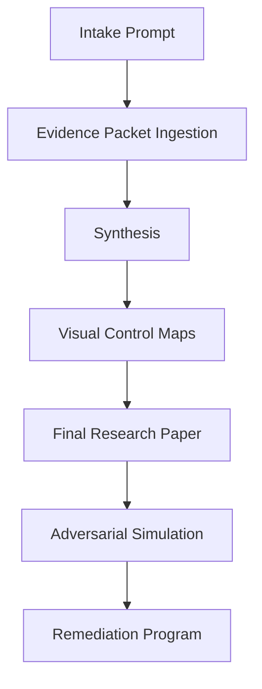

# GPT-5.4 Pro Research Launch Kit

## Use This File For

Use this file to run the forensic research program with GPT-5.4 Pro in the correct order with the correct control rules.

This file is designed so you can begin immediately.

## Important Constraint

This launch kit is complete for the audit outputs that are present in this thread and already produced during the forensic audit.

I do **not** have Stage 1 and Stage 2 outputs in the visible audit record available to me right now, so I will not invent them.

You can still start immediately with the highest-value packet order below.

If you later add Stage 1 and Stage 2 outputs, insert them in the marked positions.

## Fastest Correct Start

Run the session in this order:

1. Intake prompt
2. Stage 12 packet
3. Stage 14 packet
4. Stage 4 packet
5. Stage 5 packet
6. Stage 6 packet
7. Stage 9 packet
8. Stage 10 packet
9. Stage 11 packet
10. Stage 3 packet
11. Stage 7 packet
12. Stage 8 packet
13. Optional Stage 1 packet
14. Optional Stage 2 packet
15. Stage 13 packet
16. Synthesize prompt
17. Visual map prompt
18. Final paper prompt
19. Adversarial simulation prompt
20. Remediation program prompt

This is the best immediate order because:

- Stage 12 gives the global scorecard and blocker spine
- Stage 14 corrects repo theory with verified local-live truth
- Stages 4 to 6 give the hardest security and durability body
- Stages 9 to 11 establish governance, deploy integrity, and operational credibility
- Stages 3, 7, 8, and 13 sharpen structure, scale, tenancy shell, and benchmark positioning

## Session Discipline

In the GPT-5.4 Pro thread:

1. Paste the intake prompt first.
2. Wait for `READY FOR NEXT PACKET`.
3. Paste one packet at a time.
4. Do not let GPT summarize early.
5. After all packets, paste `SYNTHESIZE`.
6. Review the evidence map before asking for the final paper.
7. Then run the visual-map prompt.
8. Then run the final-paper prompt.
9. Then run adversarial simulation.
10. Then run the remediation-program prompt.

## Block 1: Intake Prompt

Paste this first in a fresh GPT-5.4 Pro thread:

```text
You are acting as a hostile principal engineer, security researcher, SRE, enterprise platform auditor, and systems architect.

Your task is to convert a completed forensic audit into a master research program and final research paper for a large platform.

Non-negotiable rules:

1. Treat every audit stage as evidence, not as unquestionable truth.
2. Preserve these confidence classes exactly:
   - proven issues
   - strong suspicions
   - low-confidence concerns
3. Never upgrade a suspicion into a fact.
4. Never invent repository facts, deployment facts, mitigations, or exploit chains not grounded in the evidence packets.
5. Distinguish these truth domains at all times:
   - repository truth
   - verified local-live truth
   - unverified cloud truth
   - unverified enterprise truth
6. Every major claim must cite the stage number and the file/line evidence exactly as provided in the packets.
7. If evidence is insufficient, say insufficient.
8. Be adversarial, technical, and unsentimental. Do not produce marketing language.
9. Focus especially on:
   - split authorities
   - fake abstractions
   - second identity models
   - policy bypasses
   - hidden durability gaps
   - restore illusions
   - deployment drift
   - law-firm/private deployment risk
10. Do not write the final paper until I explicitly tell you to do so.

Working protocol:

- I will send labeled evidence packets in multiple messages.
- Until I say SYNTHESIZE, reply only with:
  READY FOR NEXT PACKET
- When I say SYNTHESIZE, first produce:
  1. evidence map
  2. contradiction map
  3. missing-proof map
  4. adversarial attack-surface map
  5. proposed structure for the final master paper
- Do not write the full paper in the synthesis phase.

Important constraint:

This audit is close to a full repository map and a partial live-environment map.
It is not a full cloud or enterprise live proof.
You must not present cloud or enterprise deployment claims as verified unless a packet explicitly proves them.
```

## Packet Wrapper Template

Use this wrapper above every stage:

```text
EVIDENCE PACKET: STAGE X
Title: <stage title>
Truth domain: <repo-only | verified local-live | mixed>
Priority: <critical | high | medium>
Use this packet as evidence. Do not summarize yet. Wait for more packets.
```

## Required Packet Labels

Use these labels for the current audit corpus:

- Stage 12: `mixed`, `critical`
- Stage 14: `verified local-live`, `critical`
- Stage 4: `mixed`, `critical`
- Stage 5: `repo-only`, `critical`
- Stage 6: `repo-only`, `critical`
- Stage 9: `repo-only`, `high`
- Stage 10: `mixed`, `high`
- Stage 11: `repo-only`, `high`
- Stage 3: `repo-only`, `medium`
- Stage 7: `repo-only`, `high`
- Stage 8: `repo-only`, `high`
- Stage 13: `repo-only`, `medium`
- Stage 1: use the correct label once available
- Stage 2: use the correct label once available

## Block 2: Packet Sequence You Should Use

Below is the exact packet order.

For each packet:

1. paste the wrapper block
2. paste the exact stage output from the audit under it
3. wait for `READY FOR NEXT PACKET`

### Packet 01

```text
EVIDENCE PACKET: STAGE 12
Title: Final Forensic Scorecard
Truth domain: mixed
Priority: critical
Use this packet as evidence. Do not summarize yet. Wait for more packets.
```

Paste the exact `Stage 12` audit output below that wrapper.

### Packet 02

```text
EVIDENCE PACKET: STAGE 14
Title: Live Environment, Drift, and Restore Audit
Truth domain: verified local-live
Priority: critical
Use this packet as evidence. Do not summarize yet. Wait for more packets.
```

Paste the exact `Stage 14` audit output below that wrapper.

### Packet 03

```text
EVIDENCE PACKET: STAGE 4
Title: Amnesia Wall and Security Boundary
Truth domain: mixed
Priority: critical
Use this packet as evidence. Do not summarize yet. Wait for more packets.
```

Paste the exact `Stage 4` audit output below that wrapper.

### Packet 04

```text
EVIDENCE PACKET: STAGE 5
Title: Broker, Capability, and Runtime Isolation
Truth domain: repo-only
Priority: critical
Use this packet as evidence. Do not summarize yet. Wait for more packets.
```

Paste the exact `Stage 5` audit output below that wrapper.

### Packet 05

```text
EVIDENCE PACKET: STAGE 6
Title: Durability, Concurrency, and Replay Safety
Truth domain: repo-only
Priority: critical
Use this packet as evidence. Do not summarize yet. Wait for more packets.
```

Paste the exact `Stage 6` audit output below that wrapper.

### Packet 06

```text
EVIDENCE PACKET: STAGE 9
Title: Data Governance, Schema, and Retention Truth
Truth domain: repo-only
Priority: high
Use this packet as evidence. Do not summarize yet. Wait for more packets.
```

Paste the exact `Stage 9` audit output below that wrapper.

### Packet 07

```text
EVIDENCE PACKET: STAGE 10
Title: Build, Deployment, Config, Secrets, and Supply-Chain Audit
Truth domain: mixed
Priority: high
Use this packet as evidence. Do not summarize yet. Wait for more packets.
```

Paste the exact `Stage 10` audit output below that wrapper.

### Packet 08

```text
EVIDENCE PACKET: STAGE 11
Title: Test Coverage, Observability, and Disaster-Recovery Readiness
Truth domain: repo-only
Priority: high
Use this packet as evidence. Do not summarize yet. Wait for more packets.
```

Paste the exact `Stage 11` audit output below that wrapper.

### Packet 09

```text
EVIDENCE PACKET: STAGE 3
Title: Bloat and Spaghetti Hunt
Truth domain: repo-only
Priority: medium
Use this packet as evidence. Do not summarize yet. Wait for more packets.
```

Paste the exact `Stage 3` audit output below that wrapper.

### Packet 10

```text
EVIDENCE PACKET: STAGE 7
Title: Scale and Bottlenecks
Truth domain: repo-only
Priority: high
Use this packet as evidence. Do not summarize yet. Wait for more packets.
```

Paste the exact `Stage 7` audit output below that wrapper.

### Packet 11

```text
EVIDENCE PACKET: STAGE 8
Title: Frontend and Mobile Multi-Tenant Shell Audit
Truth domain: repo-only
Priority: high
Use this packet as evidence. Do not summarize yet. Wait for more packets.
```

Paste the exact `Stage 8` audit output below that wrapper.

### Packet 12

```text
EVIDENCE PACKET: STAGE 1
Title: <fill exact stage 1 title>
Truth domain: <fill>
Priority: <fill>
Use this packet as evidence. Do not summarize yet. Wait for more packets.
```

If you have Stage 1, insert it here. If not, skip it.

### Packet 13

```text
EVIDENCE PACKET: STAGE 2
Title: <fill exact stage 2 title>
Truth domain: <fill>
Priority: <fill>
Use this packet as evidence. Do not summarize yet. Wait for more packets.
```

If you have Stage 2, insert it here. If not, skip it.

### Packet 14

```text
EVIDENCE PACKET: STAGE 13
Title: Competitive Reference Benchmark
Truth domain: repo-only
Priority: medium
Use this packet as evidence. Do not summarize yet. Wait for more packets.
```

Paste the exact `Stage 13` audit output below that wrapper.

## Block 3: Synthesis Prompt

After the last packet, paste this:

```text
SYNTHESIZE

Using all evidence packets received so far, produce:

1. Evidence map
   - grouped by domain
   - with confidence labels
   - with major contradictions called out

2. Contradiction map
   - where repository truth and live truth disagree
   - where architecture claims and actual behavior disagree
   - where policy model and execution reality disagree

3. Missing-proof map
   - what still cannot be proven
   - which missing proofs are most dangerous
   - which missing proofs block enterprise claims

4. Adversarial attack-surface map
   - likely exploit chains
   - privilege-bleed paths
   - replay/restore abuse paths
   - law-firm/private deployment risks

5. Final paper outline
   - section order
   - thesis per section
   - what evidence belongs in each section

Rules:
- findings first
- no fluff
- preserve proven vs suspected vs low-confidence
- cite stage numbers aggressively
- do not write the final paper yet
```

## Block 4: Visual Map Prompt

After reviewing synthesis, paste this:

```text
Build a full visual control map of the platform using only the evidence already established.

Required outputs:

1. Current-state platform map in Mermaid
   - ingress paths
   - auth boundaries
   - broker/tool boundaries
   - runtime targets
   - data stores
   - channel systems
   - frontend/mobile shells

2. Current-state trust-boundary map in Mermaid
   - trusted authorities
   - second authorities
   - bypass paths
   - cross-store drift points

3. Target-state platform map in Mermaid
   - single execution contract
   - single identity authority
   - single policy authority
   - durable restoreable state model
   - bounded read model
   - enterprise-safe shell model

4. Current-state vs target-state gap matrix
   - what exists now
   - what must be removed
   - what must be merged
   - what must be built

5. Remediation-wave map
   - Wave 0: stop-the-bleeding fixes
   - Wave 1: security and authority unification
   - Wave 2: durability and restoreability
   - Wave 3: scale and shell completion
   - Wave 4: simplification and enterprise hardening

Rules:
- findings first
- no generic architecture diagrams
- no invented components
- every node must map back to established evidence
```

## Block 5: Current-State vs Future-State Prompt

Paste this next if you want a high-level but technically precise platform transformation view:

```text
Using only the established evidence, describe the platform in two states:

1. What I have right now
2. What I should have after the remediation program

For each state, provide:
- architecture summary
- security posture
- data truth model
- runtime control model
- tenant isolation model
- delivery/replay model
- scale posture
- operator control level
- enterprise law-firm suitability

Then provide:
- a Mermaid diagram for the current state
- a Mermaid diagram for the target state
- a step-by-step transition path from current to target
- why the target state is technically superior

Do not use marketing language.
Do not invent features.
Base every statement on established evidence.
```

## Block 6: Final Paper Prompt

After synthesis and visual mapping are correct, paste this:

```text
Now write the final master research paper.

Requirements:

1. Write it as an executive-grade but technically adversarial research paper.
2. Base it only on the evidence packets and synthesis already established.
3. Preserve all confidence distinctions:
   - proven issues
   - strong suspicions
   - low-confidence concerns
4. Separate clearly:
   - repository truth
   - verified local-live truth
   - unverified cloud truth
   - unverified enterprise truth
5. Do not soften the verdicts.
6. Every major section must include stage references and underlying file/line evidence.
7. Include these sections:

- Executive thesis
- Platform truth model
- Current-state system map
- Security and tenant isolation
- Broker, capability, and runtime control
- Durability, replay, and concurrency truth
- Data governance, retention, and restoreability
- Build, deployment, config, and secret drift
- Scale posture and first-failure map
- Frontend/mobile tenancy integrity
- Architectural fat and fake separation
- Adversarial attack scenarios
- Enterprise law-firm deployment implications
- Current-state vs target-state architecture
- Remediation waves
- Blockers to enterprise-grade status
- What remains unproven

8. Include visual sections using Mermaid for:
- current-state platform map
- target-state platform map
- control-boundary map
- remediation roadmap

9. End with:
- brutal verdict
- enterprise readiness verdict
- exact reasons that verdict is blocked
```

## Block 7: Adversarial Simulation Prompt

Paste this after the final paper:

```text
Using only the established evidence, build a hostile simulation matrix.

For each scenario, provide:
- prerequisites
- exact exploit chain
- required assumptions
- expected blast radius
- what telemetry would or would not detect it
- whether recovery is possible
- what invariant must hold to block it

Scenarios:
- foreign session adoption across workspace boundaries
- direct-chat broker bypass abuse
- local-companion identity drift
- duplicate delivery and replay abuse
- stale restore with partial store recovery
- autopilot connector abuse after state drift
- entitlement/profile mismatch after workspace changes
- law-firm/private tenant confidentiality breach

Do not invent defenses that were not proven in the evidence.
```

## Block 8: Remediation Program Prompt

Paste this last:

```text
Using only the established evidence and final paper, build a master remediation program for the platform.

Requirements:

1. Do not propose cosmetic work.
2. Organize the work by dependency and architectural leverage.
3. Separate:
   - stop-the-bleeding fixes
   - authority unification
   - durability / restoreability
   - scale / read-model repair
   - shell completion
   - architectural simplification
4. For each workstream provide:
   - objective
   - exact problems solved
   - prerequisite work
   - files / subsystems affected
   - risk of change
   - expected platform gain
   - what must be true before the workstream can be called done
5. Produce:
   - Wave 0
   - Wave 1
   - Wave 2
   - Wave 3
   - Wave 4
6. Include a current-state to target-state migration narrative.
7. Include a Mermaid roadmap diagram.
8. Include a “do not build features before these are fixed” section.

Rules:
- no fluff
- no fake deadlines
- no invented infrastructure
- no implementation details that were not grounded in evidence
- optimize for platform control, security, restoreability, and clarity
```

## What GPT-5.4 Pro Must Produce

Do not stop at one paper.

Use the session to get these outputs:

1. evidence map
2. contradiction map
3. missing-proof map
4. adversarial attack-surface map
5. current-state platform map
6. target-state platform map
7. current-vs-target gap matrix
8. master research paper
9. hostile simulation matrix
10. remediation program

## Research Quality Checklist

Before accepting the GPT-5.4 Pro output, verify:

- truth domains stayed separated
- confidence labels stayed intact
- no cloud proof was fabricated
- no enterprise restore proof was fabricated
- current-state and target-state visuals were included
- the system map is concrete, not generic
- blockers are ordered by leverage
- the verdict stayed hard

## Visual: Research Flow



## Practical Note

The only missing pieces in this ready-start kit are the exact contents of Stage 1 and Stage 2, because they were not available in the visible audit record I had.

Everything else is staged so you can begin immediately and in the correct order.
